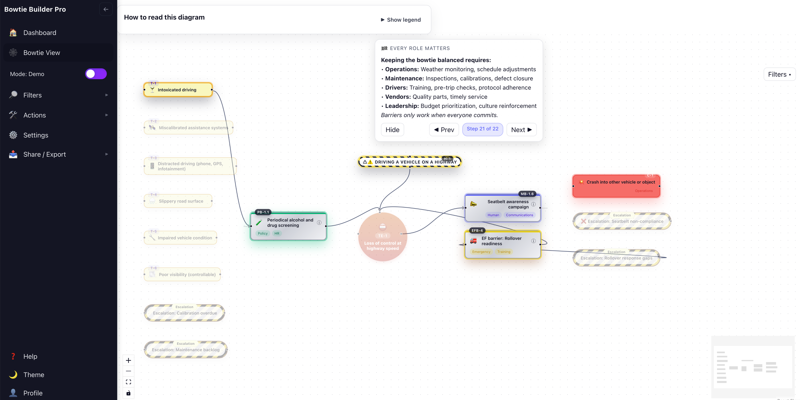

# 🎯 Bowtie Builder Pro

Professional, accessible Bowtie risk diagram tool built with React + TypeScript + Vite + React Flow + ELK.js.
https://bowtie-project.vercel.app


<div style="display: flex; gap: 16px; margin: 16px 0;">
  
  
</div>

## Scripts
- `npm run dev` – start dev server
- `npm run build` – type-check and build
- `npm run preview` – preview the production build
- `npm run test:run` – run unit tests once (no watch mode)

## Highlights
- Deterministic ELK-backed layout keeps the hazard above the top event with true left/right symmetry.
- Default “collapsed” bowtie only shows threats, escalation factors, top event, hazard, and consequences; clicking any card or running the story reveals the matching prevention/mitigation barriers.
- Story / presentation mode pulses nodes, auto-reveals the correct branches, and supports arrow-key narration plus restart collapse.
- Escalation factors stay visible as yellow striped pills; new legend entry explains their role.
- Role-based multi-select filtering (chips) with accessible live region feedback.
- Export any state of the diagram to PNG; CSS Modules + design tokens + reduced motion/focus-visible baked in.
- 🎬 **Smooth GSAP-powered zoom/pan choreography** with preattentive visual system for narrative story mode transitions.
- ✏️ **Inline node editing in Builder mode** with inspector panel for labels, tags, likelihood, severity, and metadata.

## Preattentive Visual System
- **GSAP-powered preattentive visual system** with incident timeline framework integration.

## Incident Timeline Framework

This tool implements a comprehensive **incident timeline framework** that maps the progression from normal operations through to recovery:

**Normal → Latent Conditions → Deviation → Detection → Escalation → Top Event → Consequences → Recovery/Lessons**

### Framework Applied

Each narrative step is color-coded and visually distinct using preattentive attributes:

- **🛣️ NORMAL**: Baseline operations, all barriers in place (calm gray)
- **🕳️ LATENT**: Hidden weaknesses—budget cuts, drift, normalization (warning yellow)
- **🚚 DEVIATION**: Active error or violation introduces threat (orange alert)
- **🚨 DETECTION**: Alarm/monitoring catches deviation or fails to (blue alert)
- **⚠️ ESCALATION**: Situation worsens, multiple barriers down (red alert)
- **🎯 TOP EVENT**: Control lost—prevention ends, mitigation begins (red-orange)
- **💥 CONSEQUENCES**: Harm occurs despite mitigation (red)
- **🛠️ RECOVERY**: Lessons learned, barriers strengthened (green success)

### Preattentive Attributes Used

The visual system follows the principle **"one pattern = one meaning"** (Krug-compliant):

- **COLOR**: Stage/role identification (amber = hazard, sand = threat, green = prevention, blue = mitigation, red = consequence)
- **SIZE**: Importance hierarchy (1.8× banner, 1.5× top event, 1.0× standard)
- **OPACITY**: Narrative focus (1.0 = active, 0.3 = dimmed)
- **GLOW**: Role-colored box-shadow for active emphasis
- **MOTION**: 1-2 pulse cycles on activation, then static (respects `prefers-reduced-motion`)
- **POSITION**: Left = prevention, center = knot, right = mitigation
- **SHAPE**: Circle = top event ONLY, rectangles for all others

### Key Improvements

#### Warehouse Fire Narrative (16 steps)

- Starts with **normal operations baseline** (240,000 Li-ion cells, proper spacing)
- Surfaces **latent conditions** (budget cuts, incentive misalignment, language barriers)
- Shows **specific deviations** (pallet bypasses quarantine, density increase, non-listed charger)
- Tracks **detection failures** and **escalation points** with timestamps
- Culminates in **top event** with clear consequences (full rack involvement, $8.2M loss)
- Ends with **human factors analysis** and **recovery actions** (incentive reform, bilingual SOPs)

**Example narrative step**:
```typescript
{
  title: "🕳️ LATENT: Budget Cuts Erode Three Barriers",
  body: "• <strong>Sensor calibration overdue</strong> 3 months (deferred maintenance)<br>• <strong>Wrong sprinkler heads installed</strong> to save $47K (spec violation)<br>• <strong>Hydrant flow tests skipped</strong> 2 years running (budget reallocation)",
  focusIds: ["pb-thermal-monitoring", "mb-sprinkler", "mb-fire-brigade"],
}
```

#### Highway Driving Narrative (20 steps)

- **Normal fleet operations** with defense in depth (40 trucks, ADAS, maintained vehicles)
- **Latent conditions** (maintenance backlog, policy drift, seatbelt alarm bypasses)
- **Threat landscape overview** (6 threats: intoxication, sensor drift, distraction, weather, mechanical, visibility)
- **Detailed prevention strategies** per threat type (screening, calibration, weather alerts, maintenance)
- **Specific deviation scenario** (weather + distraction + equipment failure)
- **Escalation sequence** with timestamps (black ice, ABS fault, loss of control)
- Shows **BOTH outcomes** (barrier win vs. mitigation failure)
- **Recovery and lessons learned** (telematics review, fleet-wide calibration, automation)

**Example narrative step**:
```typescript
{
  title: "🛡 PREVENTION: Managing Weather & Visibility",
  body: "🌧️🌫️ Environmental threats countered by:<br>• <strong>🌧️ Hourly weather alerts</strong> to dispatch<br>• <strong>🗓️ Schedule shifts</strong> to daylight/safer routes<br>• <strong>🚧 No-drive thresholds</strong> when traction gone<br>• <strong>💡 Running lights always on</strong> (conspicuity)<br>• <strong>🛞 ABS braking systems</strong> preserve steering",
  focusIds: ["th-slippery", "th-visibility", "pb-weather-report", "pb-adjust-schedule", "pb-no-high-risk", "pb-lights-always", "pb-abs"],
  revealIds: ["pb-weather-report", "pb-adjust-schedule", "pb-no-high-risk", "pb-lights-always", "pb-abs"],
}
```

### Design Tokens Enhanced

The design system includes comprehensive token sets for both **bowtie roles** and **incident timeline stages**:

- **Bowtie role colors**: hazard (amber), threat (sand + amber accent), prevention (green), top event (red-orange), mitigation (blue), consequence (light red)
- **Incident timeline stage colors**: normal (gray), latent (yellow), deviation (orange), detection (blue), escalation (red), recovery (green)
- **Clear visual encoding reference** in `docs/design-tokens-reference.html`
- **One pattern = one meaning** principle enforced throughout

See the [Design Tokens Reference](docs/design-tokens-reference.html) for the complete visual system specification.

## Roadmap (next)
- Time-travel scrubber that records which barriers were revealed during a workshop.
- Multi-diagram workspace with version comparison.
- Collaborative editing with real-time sync.

## Scenarios

This repo ships a professional teaching example:

**Highway Driving Risk** (fleet operations) - 20-step narrative demonstrating the full incident timeline framework with concrete examples of latent conditions, barrier failures, and human factors analysis.

Swap in your own scenario by editing `src/domain/scenarios/*`.

## Contributing

We welcome contributions! This project serves dual purposes:

1. **Academic project** – M.S. Data Science course deliverable
2. **Professional MVP** – Potential real-world risk analysis tool

**Quick start:**
- Read [CONTRIBUTING.md](CONTRIBUTING.md) for detailed guidelines
- Check [CODE_OF_CONDUCT.md](CODE_OF_CONDUCT.md) for community standards
- Review [SECURITY.md](SECURITY.md) for security reporting
- See [CONTRIBUTORS.md](CONTRIBUTORS.md) for recognition

**Before contributing:**
- Open an issue to discuss major changes
- Follow the PR template and checklist
- Ensure tests pass and code is linted
- Maintain accessibility and design system consistency

## License

MIT License - see [LICENSE](LICENSE) for details.

Copyright (c) 2025 Wilton Moore

## Acknowledgments

- Built with [React Flow](https://reactflow.dev/) and [ELK.js](https://eclipse.dev/elk/)
- Inspired by bowtie methodology from risk management literature
- Developed as part of M.S. Data Science coursework

