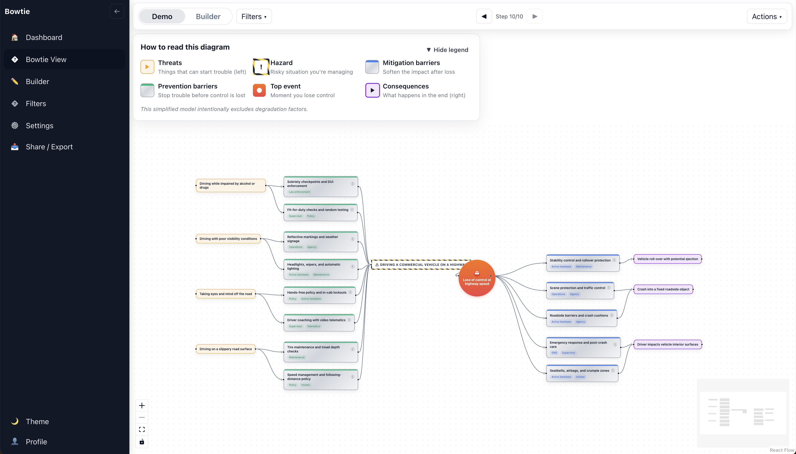

# 🎯 Bowtie Builder Pro

Professional, accessible Bowtie risk diagram tool built with React + TypeScript + Vite + React Flow + ELK.js.

## Scripts
- `npm run dev` – start dev server
- `npm run build` – type-check and build
- `npm run preview` – preview the production build
- `npm run test:run` – run unit tests once (no watch mode)

## Highlights
- Automated layout with ELK.js (left→right, 6-column bowtie)
- Progressive expand/collapse per wing and 11-step teaching mode
- Role-based multi-select filtering (chips) with accessible live region
- Legend and toolbar stacked via HUD (no overlap)
- Export current viewport to PNG
- CSS Modules + design tokens; focus-visible + reduced-motion support

## Roadmap (next)
- Pop-out Actions menu (Expand All, Collapse All, Fit All, Export)
- Collapsible Filters panel
- Collapsible left sidebar navigation
- Enhanced NodeDetailPanel (modern UX: preload on hover, failed-path highlight)
- Modern node visuals, badges/icons per role, improved center knot visuals

## Scenario
This repo ships a neutral “Highway Driving Risk” teaching example (no degradation factors by design). Swap in your own scenario by editing `src/domain/scenarios/*`.
